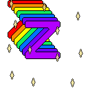

#7DS-Forecast-Photoz
<p align="center"></p>

<!--  -->
<!--  -->

A prediction study of photometric redshifts in upcoming 7-Dimensional Sky Survey

[](https://doi.org/10.5281/zenodo.8251967)


**This repo is under sconstuction!**

* [Test page](https://eunheeko.github.io/7DS-Forecast/)
* [Read the Docs](https://7ds-forecast.readthedocs.io/)
* [pip](https://pypi.org/project/svnds/0.0.1/)

## Overview
Using `svnds`, you can generate mock data that would be observed in the future 7DS and probe feasibility of science cases.

### 7-Dimensional Telescope

Chile, El Sauce Observatory (near CTIO/Cerro Pachon)

Altitude: 1700 m

320 clear nights

Median seeing ~ 1.5”


Operated by ObsTech

```geojson
{
  "type": "FeatureCollection",
  "features": [
    {
      "type": "Feature",
      "id": 1,
      "properties": {
        "ID": 0
      },
      "geometry": {
      "type": "Point",
      "coordinates": [-30.47027, -70.76494]
      }
    }
  ]
}
```

<!-- 
```geojson
{
  "type": "FeatureCollection",
  "features": [
    {
      "type": "Feature",
      "id": 1,
      "properties": {
        "ID": 0
      },
      "geometry": {
        "type": "Polygon",
        "coordinates": [
          [
              [-90,35],
              [-90,30],
              [-85,30],
              [-85,35],
              [-90,35]
          ]
        ]
      }
    }
  ]
}
``` -->

* features of 40 medium band filters

### Generate mock data
* `7DS`, `SPHEREx`, `LSST`, `Euclid`, `VIKING`, `PANSTARRS` as of Aug. 26, 2023

### Customize SED models
* to be updated

## Installlation
### pip

`pip install svnds`

### git
`git clone https://github.com/eunheeko/7DS-Forecast.git`

### To be updated


* SPHEREx only
* Customized color prior (TBD)

|Input|prior|zstep|Description|
|---|---|---|---|
|7DS Y5|$m_{6250\AA}$|0.01|photoz_7DS40_WFS_Y5_eff_adderr|
|7DS Y5 scale = 19.5|$m_{6250\AA}$|0.01|photoz_7DS40_WFS_Y5_scale_19.5_eff_adderr|
|7DS Y5 scale = 20.5|$m_{6250\AA}$|0.01|photoz_7DS40_WFS_Y5_scale_20.5_eff_adderr|
|7DS Y5 scale = 21.5|$m_{6250\AA}$|0.01|photoz_7DS40_WFS_Y5_scale_21.5_eff_adderr|
|7DS Y5 scale = 22.5|$m_{6250\AA}$|0.01|photoz_7DS40_WFS_Y5_scale_22.5_eff_adderr|
|7DS Y5 + PS1 |$m_{6250\AA}$|0.01|photoz_7DS40_WFS_Y5_eff_PANSTARRS_adderr|
|PS1 |$R$|0.01|photoz_PANSTARRS_adderr|
|7DS Y5 |$R$|0.01|photoz_7DS_WFS_Y5_eff_prior_R_adderr|
|7DS Y5 + VIKING|$m_{6250\AA}$|0.01|photoz_7DS40_WFS_Y5_eff_VIKING_adderr|
|7DS Y5 + SPHEREx|$m_{6250\AA}$|0.01|photoz_7DS40_WFS_Y5_eff_SPHEREx_adderr (QSO)|
|7DS Y5 + SPHEREx scale = 19.5|$m_{6250\AA}$|0.01|photoz_7DS40_WFS_Y5_eff_SPHEREx_scale_19.5_adderr (QSO)|
|7DS Y5 + SPHEREx scale = 20.5|$m_{6250\AA}$|0.01|photoz_7DS40_WFS_Y5_eff_SPHEREx_scale_20.5_adderr (QSO)|
|7DS Y5 + SPHEREx scale = 21.5|$m_{6250\AA}$|0.01|photoz_7DS40_WFS_Y5_eff_SPHEREx_scale_21.5_adderr (QSO)|
|7DS Y5 + SPHEREx scale = 22.5|$m_{6250\AA}$|0.01|photoz_7DS40_WFS_Y5_eff_SPHEREx_scale_22.5_adderr (QSO)|
|SPHEREx scale = 19.5|X|0.01|photoz_SPHEREx_scale_19.5_adderr (QSO)|
|SPHEREx scale = 20.5|X|0.01|photoz_SPHEREx_scale_20.5_adderr (QSO)|
|SPHEREx scale = 21.5|X|0.01|photoz_SPHEREx_scale_21.5_adderr (QSO)|
|SPHEREx scale = 22.5|X|0.01|photoz_SPHEREx_scale_22.5_adderr (QSO)|
|7DS Y5 20 filters|$m_{6250\AA}$|0.01|photoz_7DS20_WFS_Y5_eff_adderr|
|7DS Y5 20 filters (zstep = 0.001)|$m_{6250\AA}$|0.001|photoz_7DS20_WFS_Y5_eff_zstep_0.001_adderr|
|7DS Y5 40 filters (zstep = 0.001)|$m_{6250\AA}$|0.001|photoz_7DS40_WFS_Y5_eff_zstep_0.001_adderr (QSO)|

<!-- |7DS Y5 + VIKING|$m_{6250\AA}$|photoz_sds40_WFS_5yr_eff_VIKING_adderr.coeff| -->

<!-- ## Data Specifiaction


## Survey Plan
=======
# Notes


## EAZY
<!-- - read binary files: https://github.com/gbrammer/eazy-photoz/tree/f8b84a20f8e781d1f8244a24cd347a24a40f1558/inputs -->
<!-- - source code: https://eazy-py.readthedocs.io/en/latest/_modules/eazy/photoz.html -->


<!-- ## data/filters
* 7DS, SPHERE: customized
* LSST: 
* [EUCLID](https://ui.adsabs.harvard.edu/abs/2022A%26A...662A..92E/abstract): [data](https://euclid.esac.esa.int/msp/refdata/data/)
* VIKIG:  -->


<!-- ## For large data: -->
<!-- https://docs.github.com/en/repositories/working-with-files/managing-large-files -->
